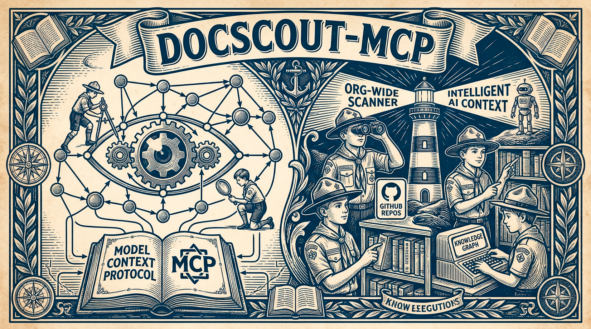
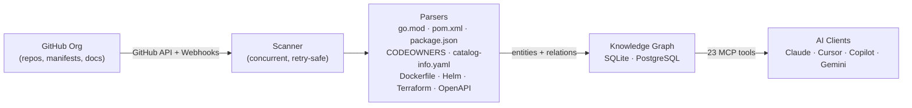

<div align="center">

# DocScout-MCP



**Give your AI assistant a reliable map of your entire GitHub organization.**

An [MCP](https://modelcontextprotocol.io) server written in Go that continuously scans your GitHub org, builds a persistent knowledge graph from manifests and docs, and exposes it to Claude, Cursor, Copilot, Gemini CLI, and any other MCP-compatible AI — with zero hallucinations.

[](https://go.dev)
[](LICENSE)
[](https://modelcontextprotocol.io)
[](benchmark/RESULTS.md)
[](benchmark/RESULTS.md)

</div>

---

## The Problem

Your AI assistant knows nothing about your internal services. Every time you ask *"which teams own the payment service?"* or *"what breaks if I take down the DB?"*, it either **hallucinates** or **burns tokens** scanning dozens of repos.

DocScout-MCP solves this by pre-computing the answer graph and serving it deterministically over MCP.

---

## How It Works



1. **Scan** — Crawls every repo in your org: docs, manifests, infra files, and root tooling files. Repeats on a configurable interval and reacts to GitHub webhooks for instant updates.
2. **Parse** — Extracts services, owners, dependencies, and relations from `go.mod`, `pom.xml`, `package.json`, `CODEOWNERS`, `catalog-info.yaml`, and more.
3. **Graph** — Persists everything as entities and relations in SQLite or PostgreSQL, surviving restarts.
4. **Answer** — AI clients query the graph via 23 MCP tools. No file-reading loops, no token waste, no guessing.

---

## Why DocScout?

| Approach | Accuracy | Token Cost | Setup |
|---|---|---|---|
| AI reads files raw | Hallucination-prone | ~27,000/question | None |
| Backstage catalog | High (manual) | Medium | Heavy (infra team) |
| **DocScout-MCP** | **Verified (F1 1.00)** | **~290/question** | **5 minutes** |

DocScout pre-computes the answer graph from your repos so your AI never reads files to answer architecture questions. See [benchmark/RESULTS.md](benchmark/RESULTS.md) for methodology.

## See It In Action

> *"What happens if I shut down `component:db`? Which systems go offline, and who do I notify?"*

```
→ search_nodes("component:db")
  Found: component:db — incoming edge: payment-service depends_on

→ open_nodes(["payment-service"])
  Entity: payment-service (service)
  Observations: _source:go.mod, go_version:1.26, _scan_repo:myorg/payment-service

→ search_nodes("payments-team")
  Entity: payments-team (team)
  Observations: github_handle:@myorg/payments-team
  Relations: payments-team → owns → payment-service

Claude: "Shutting down component:db will impact payment-service.
         Notify @myorg/payments-team. No other services have a direct dependency."
```

The AI answers from **verified graph facts** — not file naming conventions or guesses.

---

## Quick Start

### 1. Get a Fine-Grained GitHub PAT

Go to **GitHub → Settings → Developer Settings → Fine-grained tokens**.
Grant **Read-only** access to `Contents` and `Metadata` for your org's repositories.

### 2. Add to Your AI Client

**Claude CLI (recommended):**
```bash
claude mcp add --transport stdio \
  --env GITHUB_TOKEN=github_pat_... \
  --env GITHUB_ORG=my-org \
  docscout-mcp -- go run github.com/leonancarvalho/docscout-mcp@latest
```

**Or build and run locally:**
```bash
git clone https://github.com/leonancarvalho/docscout-mcp
cd docscout-mcp

GITHUB_TOKEN="github_pat_..." GITHUB_ORG="my-org" go run .
```

**Docker:**
```bash
docker run -i \
  -e GITHUB_TOKEN="github_pat_..." \
  -e GITHUB_ORG="my-org" \
  ghcr.io/leonancarvalho/docscout-mcp:latest
```

### 3. Ask Away

> *"Which services depend on the billing library?"*
> *"Who owns the checkout service?"*
> *"List all repos with a Helm chart."*
> *"What Go services have direct dependencies on pgx?"*

---

## MCP Tools (23)

| Category | Tool | What it does |
|---|---|---|
| **Scanner** | `list_repos` | All repos with indexed files, filterable by type |
| | `search_docs` | Search file paths and repo names |
| | `get_file_content` | Raw content of any indexed file (path-traversal protected) |
| | `get_scan_status` | Scanner state, last scan time, cache size |
| | `trigger_scan` | Queue an immediate full scan without waiting for next interval |
| | `search_content` | Full-text search across cached docs (`SCAN_CONTENT=true`) |
| **Knowledge Graph** | `create_entities` | Add nodes to the graph |
| | `create_relations` | Add directed edges between nodes |
| | `add_observations` | Append facts to existing entities |
| | `update_entity` | Rename an entity or change its type atomically |
| | `read_graph` | Return the full graph |
| | `list_entities` | List all entities, optionally filtered by type |
| | `list_relations` | List relations, filtered by type and/or source entity |
| | `search_nodes` | Search by name, type, or observation |
| | `open_nodes` | Retrieve entities with their relations |
| | `traverse_graph` | BFS traversal: impact analysis, dependency chains |
| | `find_path` | Shortest connection path between two entities |
| | `get_integration_map` | Full integration topology of a service in one call |
| | `delete_entities` | Remove entities (> 10 requires `confirm: true`) |
| | `delete_observations` | Remove specific facts |
| | `delete_relations` | Remove specific edges |
| **Observability** | `get_usage_stats` | Per-tool call counts + top 20 most-fetched docs |
| **Semantic Search** | `semantic_search` | Natural-language vector search (requires embedding provider) |

---

## What Gets Scanned

**Root-level manifests** (extracted into the knowledge graph):

| File | Extracts |
|---|---|
| `catalog-info.yaml` | Backstage entity, lifecycle, owner, relations |
| `go.mod` | Module path, Go version, direct dependencies |
| `package.json` | Package name, version, runtime dependencies |
| `pom.xml` | Maven artifact, version, compile/runtime deps |
| `CODEOWNERS` | Team and person ownership per repo |
| `Dockerfile`, `Makefile`, `docker-compose.yml`, `.mise.toml` | Tooling presence |
| `README.md`, `openapi.yaml`, `swagger.json` | Documentation surface |

**Recursive directories**: `docs/` and `.agents/` (`.md` files) · `deploy/`, `infra/`, `.github/workflows/` (Helm, Terraform, K8s, workflows)

---

## Key Configuration

| Variable | Required | Default | Description |
|---|---|---|---|
| `GITHUB_TOKEN` | ✅ | — | Fine-grained PAT (read-only `Contents` + `Metadata`) |
| `GITHUB_ORG` | ✅ | — | GitHub org or username |
| `SCAN_INTERVAL` | ❌ | `30m` | Re-scan interval (`10s`, `5m`, `1h`) |
| `DATABASE_URL` | ❌ | in-memory SQLite | `sqlite://path.db` or `postgres://...` |
| `HTTP_ADDR` | ❌ | — | Enable HTTP transport at this address (e.g. `:8080`) |
| `SCAN_CONTENT` | ❌ | `false` | Cache file contents for full-text search |
| `GITHUB_WEBHOOK_SECRET` | ❌ | — | Enable incremental scans on push events |

> See [full environment variable reference](docs/README.md) for all options including `SCAN_FILES`, `SCAN_DIRS`, `REPO_TOPICS`, `REPO_REGEX`, `EXTRA_REPOS`, and more.

---

## AI Client Setup

| Client | Guide |
|---|---|
| Claude Desktop / CLI | [docs/claude.md](docs/claude.md) |
| VS Code (Copilot Chat) | [docs/vscode.md](docs/vscode.md) |
| GitHub Copilot | [docs/copilot.md](docs/copilot.md) |
| Antigravity (Google) | [docs/antigravity.md](docs/antigravity.md) |
| Gemini CLI | [docs/gemini.md](docs/gemini.md) |
| ChatGPT Desktop | [docs/chatgpt.md](docs/chatgpt.md) |

---

## Architecture & Security

- **Path-traversal protection**: Only files verified by the scanner are accessible. The AI cannot read arbitrary files.
- **STDIO safety**: No text is ever written to `stdout`. All logs go to `stderr`. Corruption of the JSON-RPC stream is impossible by design.
- **Rate limit resilience**: Every GitHub API call uses exponential backoff with smart `Retry-After` handling.
- **Graph integrity**: Observations are sanitized before storage. Mass deletions (> 10 entities) require explicit confirmation.
- **Audit log**: Every graph mutation emits a structured `slog` line to stderr.

For a deep dive, see [How It Works](docs/how-it-works.md).

---

## Roadmap

See [ROADMAP.md](ROADMAP.md) for completed features and upcoming work, including:

- **Semantic Search & RAG** — vector embeddings via `pgvector`
- **Custom Parser Extensions** — plug in new manifest formats without forking
- **Integration Topology Discovery** — Kafka, gRPC, HTTP call graph from config files
- **Multi-Cloud Adapters** — GitLab, Bitbucket, Confluence
- **Documentation Wiki (gh-pages)** — move the detailed guides to a dedicated GitHub Pages site

---

## Contributing

```bash
# Install dependencies
go mod tidy

# Build
go build -o docscout-mcp .

# Test (unit + E2E integration)
go test ./...
```

Review the [Development Guidelines](docs/DEVELOPMENT_GUIDELINES.md) and `AGENTS.md` before submitting a PR.

---

## License

GNU AGPL v3

## Disclaimer

This software is provided "as is", without warranty of any kind. AI-generated output depends on indexed repository data — always verify before acting on it. See [DISCLAIMER.md](DISCLAIMER.md) for full details.
