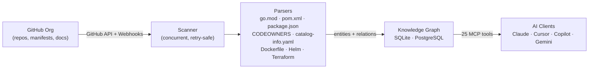

---
hide:
  - navigation
  - toc
---

<div align="center" markdown>

# DocScout-MCP

{ width="640" }

**Give your AI assistant a reliable map of your entire GitHub organization.**

An [MCP](https://modelcontextprotocol.io) server written in Go that continuously scans your GitHub org, builds a persistent knowledge graph from manifests and docs, and exposes it to Claude, Cursor, Copilot, Gemini CLI, and any other MCP-compatible AI — with zero hallucinations.

[](https://go.dev)
[](https://github.com/doc-scout/mcp-server/blob/main/LICENSE)
[](https://modelcontextprotocol.io)
[](https://github.com/doc-scout/mcp-server/blob/main/benchmark/RESULTS.md)
[](https://github.com/doc-scout/mcp-server/blob/main/benchmark/RESULTS.md)

[Get Started](https://doc-scout.github.io/mcp-server/#quick-start){ .md-button .md-button--primary }
[How It Works](how-it-works.md){ .md-button }

</div>

---

## The Problem

Your AI assistant knows nothing about your internal services. Every time you ask _"which team owns the payment service?"_ or _"what breaks if I take down the DB?"_, it either **hallucinates** or **burns tokens** scanning dozens of repos.

DocScout-MCP solves this by pre-computing the answer graph and serving it deterministically over MCP.

---

## How It Works



1. **Scan** — Crawls every repo in your org: docs, manifests, and infra files. Repeats on a configurable interval and reacts to GitHub webhooks for instant updates.
2. **Parse** — Extracts services, owners, dependencies, and relations from `go.mod`, `pom.xml`, `package.json`, `CODEOWNERS`, `catalog-info.yaml`, and more.
3. **Graph** — Persists everything as entities and relations in SQLite or PostgreSQL, surviving restarts.
4. **Answer** — AI clients query the graph via 25 MCP tools. No file-reading loops, no token waste, no guessing.

---

## Quick Start

### 1. Get a Fine-Grained GitHub PAT

Go to **GitHub → Settings → Developer Settings → Fine-grained tokens**.
Grant **Read-only** access to `Contents` and `Metadata` for your org's repositories.

### 2. Add to Your AI Client

=== "Claude CLI"

    ```bash
    claude mcp add --transport stdio \
      --env GITHUB_TOKEN=github_pat_... \
      --env GITHUB_ORG=my-org \
      docscout-mcp -- go run github.com/doc-scout/mcp-server@latest
    ```

=== "Run Locally"

    ```bash
    git clone https://github.com/doc-scout/mcp-server
    cd mcp-server
    GITHUB_TOKEN="github_pat_..." GITHUB_ORG="my-org" go run .
    ```

=== "Docker"

    ```bash
    docker run -i \
      -e GITHUB_TOKEN="github_pat_..." \
      -e GITHUB_ORG="my-org" \
      ghcr.io/doc-scout/mcp-server:latest
    ```

See [Client Integrations](integrations.md) for setup guides for VS Code, GitHub Copilot, ChatGPT, and Gemini.

---

## See It In Action

> _"What happens if I shut down `component:db`? Which systems go offline, and who do I notify?"_

```
→ traverse_graph(entity="component:db", direction="incoming", relation_type="depends_on")
  Reached: payment-service (distance=1)

→ open_nodes(["payment-service"])
  Entity: payment-service (service)
  Observations: _source:go.mod, go_version:1.26, _scan_repo:myorg/payment-service

→ traverse_graph(entity="payment-service", direction="incoming", relation_type="owns")
  Reached: payments-team (distance=1)
  Observations: github_handle:@myorg/payments-team
```

The AI answers from **verified graph facts** — not file naming conventions or guesses.

---

## Key Configuration

| Variable                | Required | Default          | Description                                          |
| ----------------------- | -------- | ---------------- | ---------------------------------------------------- |
| `GITHUB_TOKEN`          | ✅       | —                | Fine-grained PAT (read-only `Contents` + `Metadata`) |
| `GITHUB_ORG`            | ✅       | —                | GitHub org or username                               |
| `SCAN_INTERVAL`         |          | `30m`            | Re-scan interval (`10s`, `5m`, `1h`)                 |
| `DATABASE_URL`          |          | in-memory SQLite | `sqlite://path.db` or `postgres://...`               |
| `HTTP_ADDR`             |          | —                | Enable HTTP transport (e.g. `:8080`)                 |
| `SCAN_CONTENT`          |          | `false`          | Cache file contents for full-text search             |
| `GITHUB_WEBHOOK_SECRET` |          | —                | Enable incremental scans on push events              |

---

## Architecture & Security

!!! tip "Path-traversal protection"
Only files verified by the scanner are accessible via `get_file_content`. The AI cannot read arbitrary paths outside the indexed set.

!!! info "STDIO safety"
No text is ever written to `stdout`. All logs go to `stderr`. Corruption of the JSON-RPC stream is impossible by design.

!!! note "Graph integrity"
Observations are sanitized before storage. Mass deletions (> 10 entities) require explicit confirmation. Every mutation emits a structured audit log line.

For a full technical deep-dive, see [How It Works](how-it-works.md).
