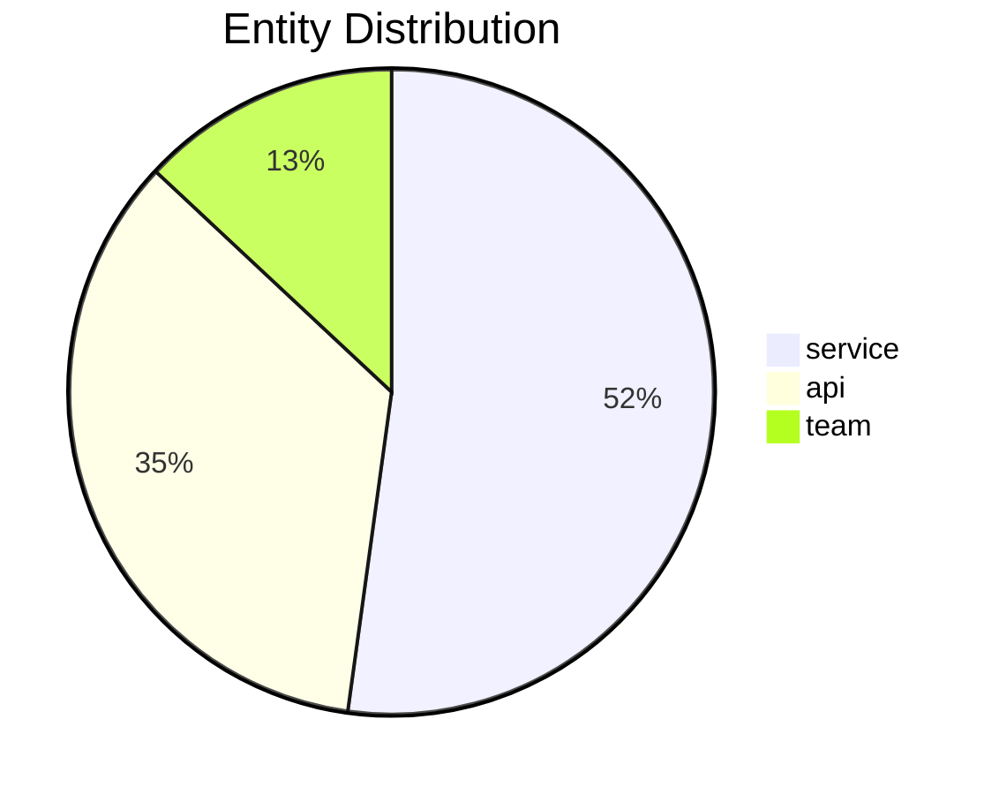
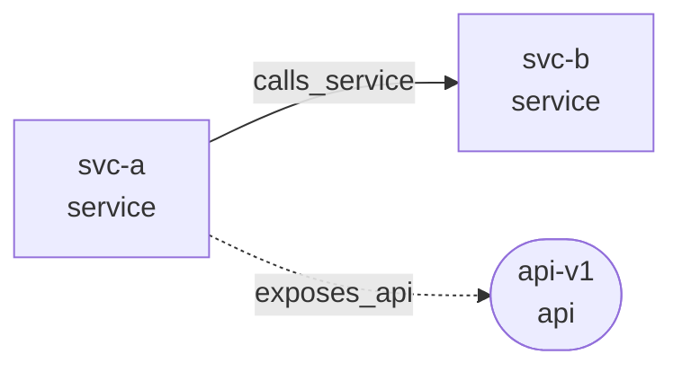

# DocScout Mermaid Graph Report — Design Spec

**Date:** 2026-04-24  
**Status:** Approved

## Problem

The `docscout-example.yml` GitHub Action currently emits a plain Markdown table with two counters (entity count, relation count). This gives no structural insight into the knowledge graph — reviewers cannot see which services exist, how they connect, or where hotspots are.

## Goal

Replace the simple counter output with a rich Markdown report containing two Mermaid diagrams: an entity-type pie chart and a service-topology flowchart. Output targets both the GitHub Step Summary and the PR comment.

## Approach

Run `go run ./cmd/report` directly from the checked-out repo after the scan completes. No additional binary is distributed; the command uses the existing internal `memory` package (GORM + SQLite) to query the temporary database that the scan already produced.

## Components

### 1. `cmd/report/main.go` (new)

Standalone Go command. Entry point only — all logic lives in `cmd/report/report.go`.

**Flags:**

| Flag | Type | Default | Description |
|------|------|---------|-------------|
| `--db` | string | _(required)_ | Path to the SQLite database file |
| `--max-nodes` | int | 20 | Cap on nodes in the flowchart |
| `--max-edges` | int | 40 | Cap on edges in the flowchart |
| `--repo` | string | `""` | `org/repo` label for the report header |
| `--elapsed` | int | 0 | Scan duration in seconds |

Writes the complete Markdown report to **stdout**. Logs errors to **stderr**. Exits non-zero on DB open failure (scan already finished so CI can warn without failing the job — caller decides via `|| true`).

### 2. Internal queries (`cmd/report/report.go`)

Uses `memory.OpenDB(path)` and the raw `*gorm.DB` for two custom queries.

**Pie data** — `MemoryService.EntityTypeCounts()` (already exists).

**Top-N nodes by connectivity:**
```sql
SELECT name, entity_type,
  (SELECT COUNT(*) FROM db_relations WHERE from_node = e.name) +
  (SELECT COUNT(*) FROM db_relations WHERE to_node   = e.name) AS degree
FROM db_entities e
ORDER BY degree DESC
LIMIT ?
```

**Edges between selected nodes:**
```sql
SELECT from_node, to_node, relation_type, confidence
FROM db_relations
WHERE from_node IN (?) AND to_node IN (?)
LIMIT ?
```

### 3. Mermaid generation rules

**Node ID sanitization** — `nodeID(name) string`:
- Replace any character outside `[a-zA-Z0-9_]` with `_`
- Prefix with `n_` if the result starts with a digit
- Ensures Mermaid parser never sees illegal identifiers

**Shape by entity type:**

| `entity_type` | Mermaid syntax |
|---|---|
| `service` | `id["name\nservice"]` |
| `api` | `id(["name\napi"])` |
| `team` | `id(("name\nteam"))` |
| `grpc-service` | `id[("name\ngrpc-service")]` |
| anything else | `id["name\ntype"]` |

**Edge style by confidence:**

| `confidence` | Arrow |
|---|---|
| `authoritative` (or empty) | `-->` |
| `inferred` | `-.->` |

**Truncation notice** (when total > cap):
```
> ⚠️ Showing 20/47 entities · 38/89 relations — top by connectivity
```

### 4. Output format

```markdown
## DocScout Graph Analysis

Scan: `org/repo` · 47 entities · 89 relations · 45s

### Entity Distribution


### Service Topology
> ⚠️ Showing 20/47 entities · 38/89 relations — top by connectivity

```

### 5. `action.yml` changes

Two new optional inputs:

```yaml
max_nodes:
  description: Maximum nodes in the topology flowchart
  required: false
  default: '20'
max_edges:
  description: Maximum edges in the topology flowchart
  required: false
  default: '40'
```

Add a `setup-go` step (using `actions/setup-go@v5`, Go version read from `go.mod`) before the scan step. Pass `MAX_NODES` and `MAX_EDGES` env vars to the scan step.

### 6. `bin/run-scan.sh` changes

After the existing sqlite3 count queries, replace the entire Step Summary and PR comment generation with:

```bash
REPORT="$(go run "${GITHUB_ACTION_PATH}/cmd/report" \
  --db "$TMPDB" \
  --max-nodes "${MAX_NODES:-20}" \
  --max-edges "${MAX_EDGES:-40}" \
  --repo "$GITHUB_REPOSITORY" \
  --elapsed "$ELAPSED" 2>/dev/null)" || REPORT=""

if [ -n "$REPORT" ]; then
  echo "$REPORT" >> "$GITHUB_STEP_SUMMARY"
else
  # Fallback to simple table if report generation fails
  { echo "## DocScout Graph Analysis"
    echo "| Metric | Count |"
    echo "|--------|-------|"
    echo "| Entities | ${ENTITY_COUNT} |"
    echo "| Relations | ${RELATION_COUNT} |"
  } >> "$GITHUB_STEP_SUMMARY"
fi
```

The PR comment body uses the same `$REPORT` variable.

## Error Handling

- If `--db` file does not exist or cannot be opened: print error to stderr, exit 1. The caller uses `|| REPORT=""` so CI does not fail.
- If `EntityTypeCounts` returns zero rows: omit the pie block, emit only the flowchart (or vice versa).
- If both datasets are empty: emit only the header line with counts.

## Testing

- Unit tests in `cmd/report/report_test.go` using an in-memory SQLite DB (via `memory.OpenDB("")`).
- Test cases: empty graph, single entity type, multiple types, truncation at cap, node name sanitization, inferred vs authoritative edges.

## Out of Scope

- Clickable nodes (Mermaid does not support hyperlinks in GH Step Summary).
- Historical diff between runs (no persistence across workflow runs).
- Filtering by `entity_types` input (existing per-type table is removed; the pie chart supersedes it).
